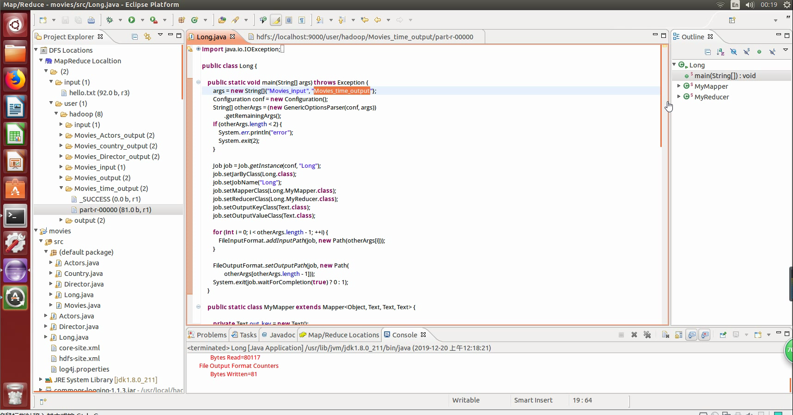

# BigData-MapReduce

#### 基于Hadoop对豆瓣电影的分析

- **爬虫爬取数据**

    利用requests， bf4等库对豆瓣高分电影的相关数据进行爬取，并提取出所需信息。

    

    

- **搭建Hadoop分布式环境**

    在VMware上搭建4个节点的hadoop集群。

- **编写MapReduce程序**

    利用MapReduce对所爬数据进行处理分析。

    

    

- **数据可视化**

    利用matplotlib和ECharts进行数据可视化分析。
    
    效果见相应文件夹